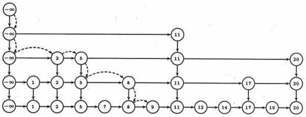
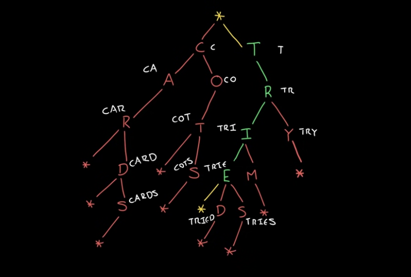

# Integrantes
* Laura Natalia Ballesteros Gualdrón 2221650
* Héctor Alirio Valdeleon Millan 2230063
* Nicol Alexa Rodriguez Alfonso 2240071
* Juan David Rey Ardila 2210080

# Primera Entrega
Debido al funcionamiento de las listas enlazadas, y lo poco eficiente que estas resultan para realizar búsquedas - debido a no tener acceso aleatorio a los elementos dentro de ella-, decidimos implementar dos scripts que solucionan el problema de ordenamiento y búsqueda dentro de una lista doblemente enlazada.

script1.py

El primer script contiene todas las implementaciones propuestas en el moodle.
Para el método de búsqueda utilizamos merge sort, y a partir de ahí, búsqueda secuencial, tanto para el método de conteo, como para el de impresión de la lista, que es lo más óptimo en este caso.
Cabe resaltar que el algoritmo de merge sort para listas enlazadas toma la forma O(logn), y el de búsqueda lineal O(n).

skip-list.py

El segundo script es un paso adelante en tiempos de ejecución y funciona bajo la estructura skip-list. Esta estructura se asemeja a la del metro de varias ciudades del mundo, y funciona por niveles, con la cabeza en la esquina superior izquierda y con valor menos infinito por defecto.

Para la implementación utilizamos 4 apuntadores por nodo, con todos los nodos en el primer nivel (nivel 0) y en los niveles superiores algunos de ellos, escogidos bajo aleatoriedad dentro del método insertar.

¿Cómo funciona el algoritmo? 
Insertar:
1.	Buscar(x) y encontrar dónde debería estar posicionado en la lista con nivel 0.
2.	Insertar x en la lista con nivel 0 para cumplir con la invariante que nos advierte de la existencia de todos los nodos en el primer nivel.
3.	Lanzar una moneda. Mientras el resultado sea cara, promover el nodo a un nivel superior manteniendo la cabeza como extremo izquierdo en el nuevo nivel. De lo contrario, detener el procedimiento. (Este paso lo implementamos mediante la librería random de python)

Eliminar:
1.	Buscar(x) y encontrar su posición.
2.	Si x está en primer nivel. Desvincular sus apuntadores.
3.	Si x está en un nivel superior. Desvincular sus apuntadores desde arriba hasta el nivel 0 o primer nivel.
 
Buscar:
1.	Caminar la lista desde la esquina superior izquierda. Último nivel. Hasta encontrar un nodo con valor superior al que queremos buscar.
2.	Bajar de nivel.
3.	Seguir caminando hasta encontrar x o un nodo mayor que x.

Por defecto, el método de búsqueda retorna el nodo encontrado sea cual sea su nivel, sin embargo, esto no sucede cuando el nodo no se encuentra en la lista, y es ahí en donde el método insertar basa su funcionamiento, ya que si el nodo no se encuentra, el método de búsqueda bajará hasta el primer nivel o nivel 0 y devolverá la posición en donde debería estar, para luego realizar su inserción. Esto por defecto sucede en el nivel 0, puesto que si un nodo no está en un nivel superior, no estará tampoco en el nivel 0, y el método de búsqueda llegará hasta este nivel para encontrar la posición correcta.

Skip List se construye bajo aleatoriedad y aunque no es exactamente igual a un árbol binario, toma una forma parecida a un árbol. Sus métodos insertar, eliminar, y buscar, toman la forma O(logn).

Recursos:

https://ocw.mit.edu/courses/6-046j-introduction-to-algorithms-sma-5503-fall-2005/resources/lecture-12-skip-lists/

https://www.osa.fu-berlin.de/bioinformatics_msc/en/exemplary_tasks/informatics_algorithms/index.html

# Segunda Entrega

Al momento de realizar el cambio en la estrucutra de datos de la primera entrega, nos dimos cuenta de lo efectivo que resultan los árboles para el manejo de las rutas, ya que cada nodo hijo hace referfencia a una parada dentro de la ruta a seguir.
Debido a esto, decidimos continuar con la temática de rutas utilizada en la primera entrega, pero esta vez permitiéndole al usuario crear la estrucutra al inicio del programa y durante este proceso calculamos el peso, nivel y grado del arbol que se está construyendo. Además, implementamos la libreria BigTree para utilizar su función de impresión para ver graficamente lo construido, y en conjunto con nuestra clase nodo, crear el mmismo.
Luego de haber implementado las funcionalidades básicas de la primera entrega, construimos un método de búesqueda mediante árboles prefijos, el cual encuentra coincidencias en base a lo ingresado en consola por el usuario.

¿Cómo funciona el código?
 1. Se solicita al usuario ingresar el nombre de los nodos nivel tras nivel.
 2. Se le muestra al usuario el árbol construido.
 3. El usuario pulsa 1 para ingresar al método adicional de búsqueda.

¿Cómo funciona el árbol prefijo (método de búsqueda)?
 1. Por cada nodo que fue creado en la funcionalidad básica, se recorre cada letra de este nodo y se crea un diccionario para cada letra, el cual tiene como valor el siguiente nodo. De esta manera, se construye una cádena de nodos que servirá para el método de coincidencias más adelante.
 2. Se recorre el árbol prefijo letra por letra de la cadena ingresada por el usuario, este recorrido finaliza en el último caracter escrito por el usuario.
 3. Una vez ubicado el último nodo, se buscan las ramas que coinciden por la cadena ingresada por el usuario. Estas coincidencias se le ofrecen al usuario con el fin de que pueda escoger la estación que busca.
 4. Luego de realizar la selección de la estación correcta, se busca su posición en el árbol inicialmente creado, con el fin de informarle al usuario cuantas estaciones debe pasar desde la estación raiz, incluyendola, para llegar a la estación deseada.
    

# Tercera Entrega

## 1.1 Descripción del problema: 

En situaciones de emergencia, como huracanes o inundaciones, la evacuación oportuna y efectiva es crucial para salvaguardar vidas. En el estado de Florida (Estados Unidos), las carreteras principales juegan un papel vital en trasladar a las personas desde zonas de riesgo hacia áreas seguras. Sin embargo, durante una evacuación inmediata, el flujo vehicular combinado de evacuados y residentes de zonas con menor riesgo de ser afectadas, aumenta considerablemente, llegando incluso al punto de sobrepasar el volumen de tráfico permitido por autopistas y generar colapso. Este proyecto busca abordar este desafío mediante el cálculo del flujo máximo que pueden soportar estas rutas clave. Con base en datos de tráfico ajustados, la herramienta permite identificar cuellos de botella y proporciona información valiosa para que los responsables de la evacuación optimicen la distribución de vehículos, asegurando así una salida más eficiente y reduciendo el riesgo de obstrucciones críticas.

## ¿Por qué escogimos esta zona? 

Escogimos Florida, específicamente el condado de Collier, debido a su alta vulnerabilidad a desastres naturales, especialmente huracanes, que obligan a realizar evacuaciones de carácter rápido y masivo de zonas costeras y urbanas.
Teniendo en cuenta que la infraestructura en estas vías es variable y su capacidad vehicular no es la misma a lo largo del condado de Collier, la gestión del flujo vehicular en una evacuación repentina, se convierte en un desafío logístico, dando así lugar a la importancia de contar con un análisis preciso de las rutas y la capacidad de las mismas para soportar el flujo vehicular al que se enfrentarán.
Para cumplir con los requisitos del proyecto, se decidió convertir los nodos de salida y de entrada de la evacuación en variables que el usuario deberá elegir, y de esta manera mostrar la dinámica del grafo y del algoritmo.

## ¿Qué tipo de grafo modela el problema? 

Grafo dirigido, ponderado, de 24 nodos, con origen y sumidero dinámico. Cada nodo representa puntos clave de flujo vehicular y cada arista basa su capacidad en el 10% del Tránsito Promedio Diario Anual (TPDA) de la vía que representa. El cálculo del 10% del TPDA para una vía, es una aproximación realista a la cantidad de vehículos que circulan en ella durante un estado de congestión masiva.

## Parámetros clave

Este análisis considera el peor escenario: una evacuación urgente sin tiempo para planificar. Evaluando las capacidades de las vías, podemos determinar la máxima cantidad de vehículos que pueden circular, lo que ayudará a organizar mejor la evacuación y evitar embotellamientos mayores.
   
A partir de lo mencionado, es necesario tener presentes ciertos parámetros clave, ya que son fundamentales tanto para el análisis y comprensión del problema como para su correcta implementación en código.

* Rango de Tiempo:
El análisis se realiza en el rango de una hora, específicamente en la hora de mayor congestión, cuando el tráfico está en su máxima capacidad.
* Vías principales:
La evacuación se considerará en base a las vías principales designadas por el departamento de Transporte del estado Florida, pues pese a que hay muchas vías que podrían considerarse, las seleccionadas son las más aptas para un flujo de tal magnitud.
* Enfoque en estado de congestión masiva:
Se realiza el enfoque durante este momento, ya que para optimizar la evacuación es necesario tener presente la condición más esperada para una operación como esta.

# 1.2 Investigación del problema y alternativas de solución:

## Introducción al problema de flujo máximo

Así como es posible modelar un trayecto en un grafo dirigido para calcular el camino más corto de un punto a otro, también podemos interpretar el grafo como una red de flujo donde cada arista tiene una capacidad máxima, y los nodos fuente y sumidero, con grado de salida mayor a cero y cero respectivamente, establecen el inicio y llegada del flujo que transporta el grafo. 
Lo interesante de este problema y debido a lo cual se asocia con el problema anterior, es la idea de la representación de cada arista como un conducto por el que fluye algo en específico, volviendo de este problema un modelo para diversos campos, como lo son el del paso de fluidos por conductos, distribución óptima de una red eléctrica, circulación de información a través de redes de comunicación, y flujo vehicular.

En el problema de flujo máximo se busca calcular la mayor tasa a la que podemos transportar el material desde la fuente hasta el sumidero sin violar ninguna de las restricciones de capacidad, o en términos relacionados con el problema establecido, la máxima cantidad de vehículos que pueden recorrer un condado en estado de evacuación inmediata sin sobrepasar el límite de las vías y generar embotellamientos de mayor magnitud.

## Nodos y Aristas

Además de establecer qué representan los nodos y aristas en el problema, nos valemos de mencionar algunos atributos clave de estos elementos.
Es importante aclarar que para la correcta implementación del método, cada arista (u, v) o arista positiva al flujo, que pasa a través del grafo G = (V, E), debe tener una capacidad no negativa, además de no tener otra arista (v, u), o arista opuesta al flujo, ya que esta arista se reserva para el manejo de la red residual y almacenar los valores que esta misma red genera dentro del camino aumentante.

## Algoritmos de exploración de grafos

El método Ford-Fulkerson funciona bajo DFS (Depth First Search) o Búsqueda en Profundidad, lo que lo vuelve propenso a tiempos de ejecución indeterminados. Una solución a este problema es la implementación de BFS (Breadth First Search) o Búsqueda en anchura, la cual funciona bajo el algoritmo de Edmonds Karp dentro del método de Ford-Fulkerson, convirtiéndolo así en un problema con tiempo de ejecución polinomial.

## Evaluación y modelado de una red residual

El corazón del método de Ford-Fulkerson está en el funcionamiento de la red residual , la cual además de establecer nuevas capacidades para todas las aristas opuestas y positivas al flujo, restringe la búsqueda del camino (BFS) por aristas positivas al flujo,  donde la capacidad actual de la arista sea igual a cero. 
 
La red residual funciona de la siguiente manera: 

1. Se establece el camino por el cual se va a recorrer el grafo en la siguiente iteración.
2. Se almacena el flujo mínimo de este camino, es decir, el valor más pequeño entre las aristas que lo conectan.
3. La red residual se empieza a crear a partir de las siguientes condiciones para aristas opuestas y positivas al flujo:
4. A cada arista (u, v) o arista positiva al flujo se le resta el valor del flujo mínimo calculado previamente.
5. A cada arista (v, u) o arista opuesta al flujo se le suma el valor del flujo mínimo calculado previamente. 

Como consecuencia a la red residual creada, las aristas positivas al flujo son propensas a quedar con un valor de cero, tanto en la primera como en las futuras iteraciones sobre el grafo. Estos nuevos valores sobre el grafo, forman un conjunto total de nuevas aristas, también conocido como camino aumentante.

## Camino aumentante

La consecuencia de cada iteración de búsqueda del BFS y la respuesta de la red residual, es un camino aumentante que establece nuevos valores para cada arista, tanto opuesta al flujo como positiva al flujo. Es por esto que el grafo base, el cual empieza sin aristas opuestas al flujo, deja de ser iterado a partir de la segunda búsqueda con BFS, para ser reemplazado por uno con caminos aumentantes nuevos en cada iteración.

# Resultados y Conclusiones

El flujo final calculado por el código nos muestra las rutas a tener en cuenta para obtener el flujo vehícular máximo dentro del condado de Collier, logrando así una evacuación aún más efectiva hacia Immokalee, con menos probabilidades de saturar y comprometer vías alternas.
